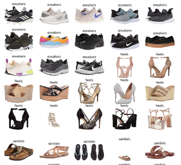

# Shoes Suggestion

This a CNN build with Tensorflow & Tensorflow-Hub shoes classification 
with buying suggestion in the top 10 sites for buying shoes in the USA.

Build with Transfer Learning using GoogleNet "Inception V3"
<p align = "center">
    
</p>

## Requirements

- Python 3
- Tensorflow > 0.12
- Numpy
- Tensorflow Hub

## Training

Train:

```bash
./model.py 
```
